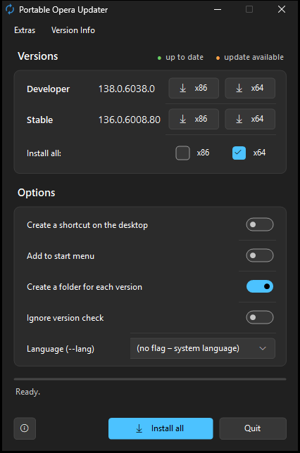

# Portable Opera Updater

A small Windows program that downloads **Opera** in the channels **Developer and Stable** (each x86 and x64) and installs it as a **portable version** – no installer, nothing written to `%LOCALAPPDATA%`, one self-contained folder per version.



## Download

- **[Latest release](https://github.com/naderi/portable-opera-updater/releases/latest)** – download `OperaUpdater.exe`, put it into an empty folder where the browsers should go (e.g. `D:\Apps\Opera`) and run it. No installation needed.
- Or with [Scoop](https://scoop.sh):

  ```
  scoop bucket add naderi https://github.com/naderi/scoop-bucket
  scoop install naderi/portable-opera-updater
  ```

  With Scoop, keep **Create a folder for each version** switched on (the default): the version folders, the settings and the shared profile are kept across `scoop update`.

**Requirements:** Windows 11 with .NET Framework 4.5 or later (preinstalled).

## How it works

1. Opera provides all versions on its download server: `https://get.geo.opera.com/pub/opera/desktop/` (Stable) and `…/pub/opera-developer/` (Developer). The updater reads the folder list and takes the highest version number.
2. New version folders can exist before the Windows files are uploaded; then the next older version is used.
3. The package `Opera[_Developer]_<version>_Autoupdate_x64.exe` is downloaded (x86 without `_x64`, about 130 MB). It contains the complete Opera without an installer UI.
4. The download is verified by **SHA-256** against the `….exe.sha256sum` file Opera provides next to it.
5. The package is a 7z self-extractor. It is **not run** but extracted with the `tar.exe` that comes with Windows (`opera.exe`, `opera_browser.dll` …). `opera_autoupdate.exe` is removed (see below), and the content becomes `App\`.
6. `App\` gets read/execute permissions for **ALL APPLICATION PACKAGES** and **ALL RESTRICTED APPLICATION PACKAGES** (see below).

> **Opera Beta** is not offered: the `opera-beta` folder was last updated in January 2026 (version 126, while Stable is at 136).
>
> **Requirement:** Windows 11. The `tar.exe` of Windows 10 cannot read LZMA-compressed 7z archives; the updater then reports *"Unpacking failed (tar.exe needs 7z support, Windows 11)"*.

> **Why the permissions?** Opera runs its renderers in an AppContainer sandbox, which may only read folders that are shared with these two groups – as `C:\Program Files` is. Other drives or folders (e.g. `D:\Apps`) usually lack them, and then no page loads and the browser stops responding. The updater sets the permissions on every installation and also checks existing installations at startup. To do it by hand:
> `icacls "<folder>\App" /grant *S-1-15-2-1:(OI)(CI)(RX) *S-1-15-2-2:(OI)(CI)(RX)`

## Using it

| Element | What it does |
|---|---|
| **x86 / x64** per channel | Installs or updates this version. **Green** with a check mark = up to date, **orange** = update available, neutral with a download arrow = not installed. The tooltip shows the folder and the installed version. |
| **Install all: x86 / x64** + **Install all / Update all** | Installs or updates all channels of the selected architectures. Versions that are up to date are skipped. |
| **Create a shortcut on the desktop** | Creates a desktop shortcut after installing (pointing to `OperaPortable.exe`). |
| **Add to start menu** | Creates a start menu entry after every installation or update – in the start menu folder **"Opera Portable"** (with *Create a folder for each version*) or as the entry "Opera Portable". Single entries can be removed again via *Extras → Add to start menu*. |
| **Create a folder for each version** | On: every channel gets its own folder (`Opera Stable x64` …). Off: installs directly into the updater's folder; *Install all* is disabled then. |
| **Ignore version check** | Downloads and installs again even if the version is already up to date. |
| **Language (--lang)** | UI language of Opera. Written as `--lang=…` into `Flags=` of every `OperaPortable.ini` – immediately for all installed versions and on every further installation. An existing `--lang=…` is replaced; *(no flag – system language)* removes it. |
| **Quit** | Closes the program. During a download it becomes **Cancel**. |
| **ⓘ** (bottom left) | About window with version, developer, GitHub link and program updates. |

**Extras menu**

- *Check versions again* (F5)
- *Open install folder*
- *Create shortcuts on the desktop now* – for all installed versions
- *Add to start menu* – with **Create a folder for each version** a submenu: *All installed versions*, every installed version on its own (check mark = in the start menu, a click adds or removes it) and *Remove all from start menu*. The entries are in the start menu folder **"Opera Portable"**. Without that option it is a single item that adds or removes the entry "Opera Portable".
- *Portable profile for each version* (`.\User Data`) / *One portable profile for all versions* (`..\User Data`) – applied to all installed versions right away
- *Keep downloaded installers* / *Delete downloaded installers* – the packages are kept in `Update\`; an existing package with the right checksum is reused

**Version Info menu:** links to the Opera desktop blog (changelogs), the download archive and the about window.

If a Opera instance from the target folder is still running, the updater asks you to close it instead of overwriting files in use. The program appears in German when Windows is set to German, otherwise in English. It follows the light or dark Windows theme and the accent color.

## Folder structure

With **Create a folder for each version**:

```
<updater folder>\
├─ OperaUpdater.exe
├─ OperaUpdater.ini              settings of the updater
├─ User Data\                     only with "one profile for all versions"
├─ Opera Stable x64\
│  ├─ OperaPortable.exe        ← start Opera with this
│  ├─ OperaPortable.ini        settings of the launcher
│  ├─ User Data\                  portable profile (with "profile for each version")
│  └─ App\
│     ├─ opera.exe …
│     └─ updates\Version.log
└─ …
```

Without that option, `OperaPortable.exe`, `OperaPortable.ini`, `App\` and `User Data\` are placed directly in the updater's folder.

## The launcher `OperaPortable.exe`

Opera has no built-in portable mode. The launcher takes care of it:

- starts `App\opera.exe` with `--user-data-dir=<portable profile>`, so nothing ends up in `%LOCALAPPDATA%`,
- appends the switches from `OperaPortable.ini` and its own command line arguments (e.g. a URL),
- carries the icon of its channel.

> **No auto-update:** Opera ships its own updater (`opera_autoupdate.exe`), which runs at startup and would download and install the regular Opera. The updater **removes it on every installation** from `App\`; there is no documented switch to turn it off. Opera runs fine without it. Updates come only through this updater.

### OperaPortable.ini

Next to every `OperaPortable.exe`. Lines starting with `;` or `#` are comments.

```ini
UserDataDir=User Data
Flags=--no-default-browser-check --no-first-run --lang=en-US
```

**`UserDataDir`** – folder of the profile (bookmarks, extensions, history, cache …), relative to the launcher's folder or absolute. `User Data` = own profile for this version (default), `..\User Data` = one profile in the updater's folder for all versions.

> The updater rewrites `UserDataDir` on every installation and when you switch it in the *Extras* menu, so better change the profile there. Only the `Flags=` line is kept on updates. A **shared profile** should not be used by two versions at the same time, and a profile of a newer version (e.g. Canary) often cannot be opened by an older one (e.g. Stable) any more.

**`Flags`** – additional command line switches, all **on one line**, separated by spaces; put paths with spaces in quotes. Examples:

| Switch | Effect |
|---|---|
| `--no-default-browser-check` | no question about the default browser |
| `--no-first-run` | skips the welcome page on the first start |
| `--lang=de` | UI language – managed by the updater's **Language** selection |
| `--start-maximized` | starts maximized |
| `--incognito` | starts in incognito / private mode |
| `--disk-cache-dir="R:\Cache"` | puts the cache elsewhere (e.g. a RAM disk); use an absolute path |
| `--proxy-server="socks5://127.0.0.1:1080"` | uses a proxy |
| `--disable-extensions` | disables all extensions |
| `--remote-debugging-port=9222` | remote debugging (e.g. for Puppeteer/Playwright) |

An (unofficial) list of all Chromium switches: <https://peter.sh/experiments/chromium-command-line-switches/>. Arguments passed to `OperaPortable.exe` are forwarded too, e.g. `OperaPortable.exe https://example.com`.

## Updates of the updater

The updater updates itself from the [releases of this repository](https://github.com/naderi/portable-opera-updater/releases):

- Once a day it looks for a new version in the background (can be switched off in the about window: *Check automatically (once a day)*). If there is one, the ⓘ button gets an orange dot.
- In the about window: *Check for updates* → *Download update* → *Restart & update*.
- A download is only used if its signature (`.sig`) matches the key built into the program; anything else is rejected. The running EXE is renamed to `.old`, the new one takes its name, and the program restarts. `OperaUpdater.ini` and all data next to it stay untouched.
- Installed with Scoop, the program only points to `scoop update portable-opera-updater`.

## Disclaimer

This is an independent project. It is not affiliated with, endorsed or sponsored by Opera. Opera and its logo are trademarks of their respective owners. The browsers downloaded by this program are subject to their own license terms.

## License

Freeware – free to use, but **not for sale**. See [LICENSE](LICENSE).

© 2026 [Ali Naderi](https://github.com/naderi)
